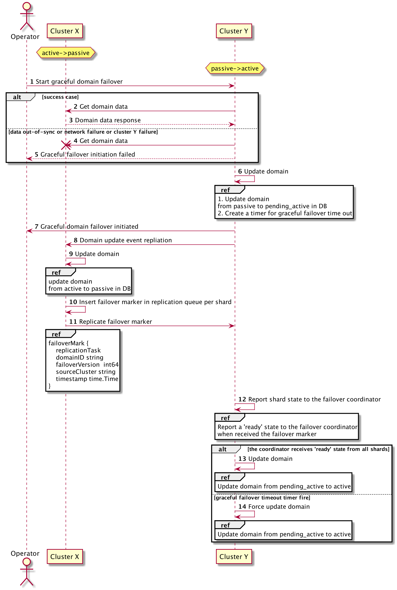
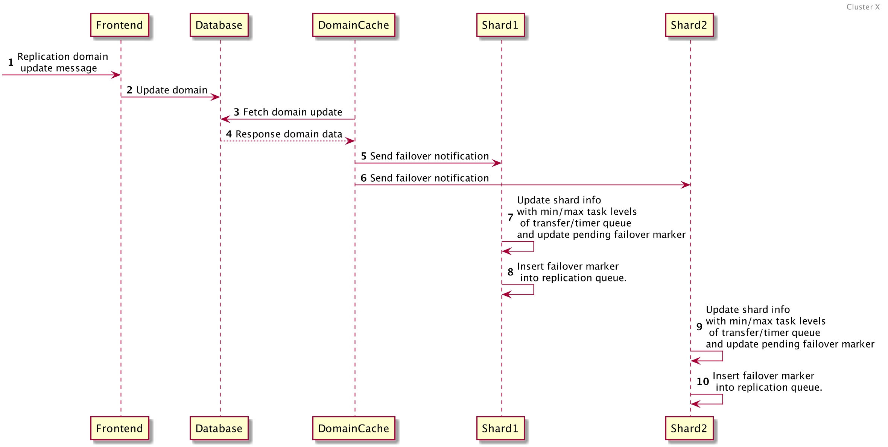
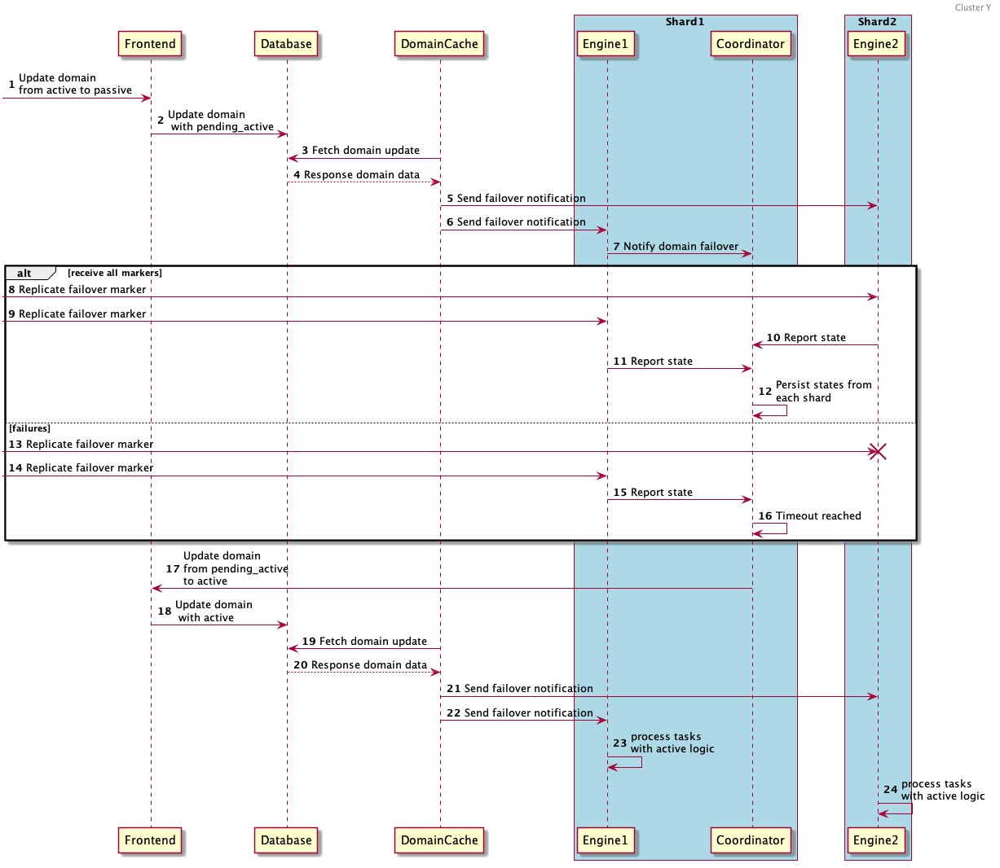
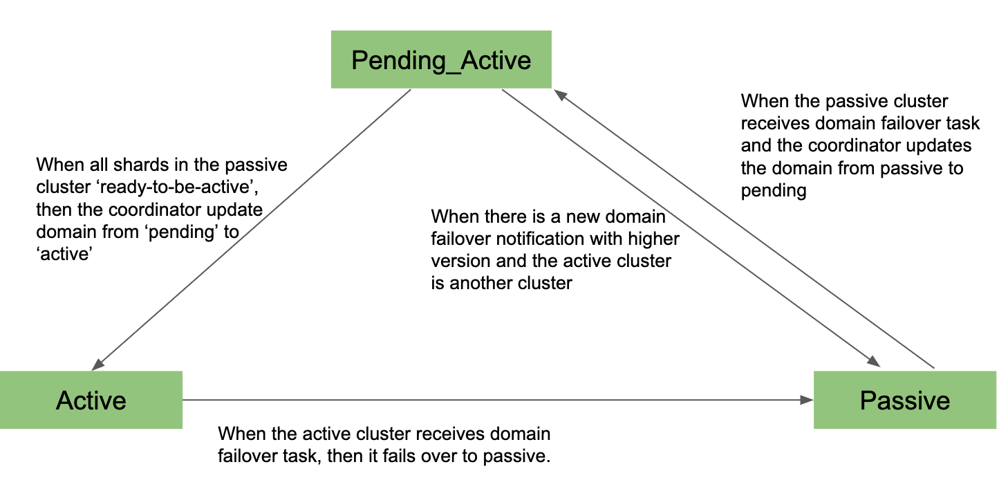

# Design doc: Cadence graceful domain failover

Author: Cadence Team

Last updated: Mar 2020

Reference: [#3051](https://github.com/uber/cadence/issues/3051)

## Abstract

Cadence supports domain failover with multi-cluster setup. However, the problems with the current failover are:
1. Workflow progress could be lost.
2. No causal consistency guarantee on domain level.

The graceful domain failover uses to solve those two problems.

## Use cases

Users can trigger graceful domain failover via Cadence CLI (timeout is optional):

`cadence --domain cadence-global domain update -failover_type graceful -active_cluster XYZ -failover_timeout 120s`

Users can force complete domain failover via Cadence CLI:

`cadence --domain cadence-global domain update -failover_type force -active_cluster XYZ`

## Prerequisites
There are conditions before starting a graceful domain failover.
1. All clusters are available.
2. The networking between clusters are available.
3. The domain state has to be stable prior to graceful failover.

## Limitation
No concurrent graceful domain failover will be supported.

## Proposal

Due to the complexity of the protocol, it will go through the architecture from cross-cluster level, single cluster level to host level.

The basic protocol is to insert markers in the active-to-passive cluster to indicate the boundary when the domain switches to passive. On the other side, the passive-to-active cluster listens to those markers and switches domain to active after receiving all the markers.

### Cross cluster level

1, The operator issues a graceful failover to the passive-to-active cluster.

2 - 3, The passive-to-active cluster gets domain data from all other clusters for two purposes: 1. Make sure the network and clusters are available prior to start the graceful failover. 2. Make sure there is no ongoing failover.

4 - 5, If the check fails, return an error to the operator indicating the graceful failover abort.

6, After the graceful failover is initiated, cluster Y updates the domain to pending_active with a higher failover version to database.

7, Respond the operator indicating the graceful failover initiated.

8, The domain update event in step 6 replicates to cluster X.

9, Cluster X updates the domain with the higher failover version and sets the domain to passive.

10, Each shard receives a domain failover notification. The shard persists the pending failover marker and inserts the marker to the replication queue.

11, The inserted failover marker replicates to cluster Y.

12, Each shard in cluster Y listens to the failover marker and reports the ‘ready’ state to the failover coordinator after it receives the failover marker. Even if the shard receives the failover marker, the shard won't process tasks as active until all shards receives failover markers.

13, The failover coordinator updates domain from pending_active to active when received ‘ready’ signal from all shards.

14, The failover coordinator updates domain from pending_active to active when the timeout hits and regardless how many ‘ready’ signals it received.

From the high level sequence diagram, it explains how the protocol works within multi-clusters. There is detail at cluster level.

### Cluster X

1, Frontend receives a domain replication message.

2, Frontend updates the domain data in Database with activeCluster set to Cluster Y and a higher failover version.

3, Domain cache fetch domain updates in a refresh loop.

4, Database returns the domain data.

5-6, After the domain updates, domain cache sends a domain failover notification to each shard.

7, Shard 1 updates the shard info with a pending failover marker to insert.

8, Shard 1 try to insert the failover marker and remove the pending failover marker from shard info after successful insertion.

9, Shard 2 updates the shard info with a pending failover marker to insert.

10, Shard 2 try to insert the failover marker and remove the pending failover marker from shard info after successful insertion.

### Cluster Y

1, The graceful domain failover request sends to the Frontend service.

2, Frontend updates the domain in the database with a flag indicating the domain is Pending_Active.

3, Domain cache fetch domain updates in a refresh loop.

4, Database returns the domain data.

5, After the domain updates, domain cache sends a domain failover notification to each shard.

6, After the domain updates, domain cache sends a domain failover notification to each shard.

7, In shard 1, the engine notified the coordinator about the domain failover.

Happy case:

8, Shard 2 receives failover marker.

9, Shard 1 receives failover marker.

10, Shard 2 reports the ‘ready’ state to Coordinator.

11, Shard 1 reports the ‘ready’ state to Coordinator.

12, Coordinator persists the states from each shard.

Failure case:

13, Shard2 does not receive failover marker.

14, Shard 1 receives failover marker.

15, Shard 1 reports the ‘ready’ state to Coordinator.

16, The graceful failover timeout reached.

After:

17, Coordinator update domain to active via frontend.

18, Frontend updates the domain in the database with active state.

19, Domain cache fetch domain updates in a refresh loop.

20, Database returns the domain data.

21, After the domain updates, domain cache sends a domain failover notification to each shard.

22, After the domain updates, domain cache sends a domain failover notification to each shard.

23, Shard 1 starts to process events as active.

24, Shard 2 starts to process events as active.

## Implementation

New components:
1. New state in domain
2. New task processor
3. Failover marker
4. Failover coordinator
5. Buffer queue

### Domain

A new state "Pending_Active "introduced when domain moves from Passive to Active. When domain is in Pending_Active, no task will be processed as active.

Active to Passive: This happens when a domain failover from ‘active’ to ‘passive’ in the cluster.

Passive to Pending_Active: This happens when a domain failover from ‘passive’ to ‘active’ in the cluster. In this pending-active cluster, it first updates domain state to pending.

Pending_Active to Passive: This happens when the domain is in ‘pending_active’, the coordinator receives a domain failover notification with a higher version and the domain failovers to another cluster. Then the domain moves back to passive.

Pending_Active to Active: The coordinator moves domain from ‘pending_active’ to ‘active’ in the scenarios:
1. All shards received the failover notification and failover markers. 
2. The failover timeout reaches and the domain is not ‘active’.

### Task processor

As the new state introduced during graceful domain failover in the passive cluster, new task processor introduce here to handle the task in Pending_Active state.

Transfer: Blocked on processing task during failover and continue to process tasks after domain switches to active.

Timer: Blocked on processing task during failover and continue to process tasks after domain switches to active.

### Failover marker
FailoverMarker {

    *replicationTask
    failoverVersion int64
    sourceCluster string
    Timestamp time.Time
}

### Failover coordinator
With the graceful failover protocol, we need to maintain a global state (in the same cluster) of all shards. So we need a new component for it. The coordinator could be a stand-alone component or elect a leader from the shards. This new component is to maintain a global state of all shards during a failover.
To maintain the global state
Each shard does heartbeat to the coordinator to send the last X minutes failover marker (X is the max graceful failover timeout we support).

The coordinator persists the state in memory and updates this state to database periodically. The state can be stored in the shard table. The state struct looks like:
map[string][]*int32
The key contains the domain and the failover version.
The value is a slice of shard ID.
Failover timeout
Currently, each history host has a component domain cache. Each shard on the same host gets domain failover notification from the domain cache. Domain cache periodically checks the database and updates the domain in memory. The failover timeout can leverage this component.

During graceful failover domain update, we record the timeout in the domain data. Domain cache reads all domain data periodically and checks if any of the graceful failover should be timed out. If the domain cache get a graceful failover to be timed out. It can sends a notification to shard to update the domain from pending_active to active.

### Buffer queue
During graceful failover, the task processing pauses. However, we still need to keep processing the API requests listed below. To support this, we introduce the buffer queue in each shard. The main idea is to buffer all the API requests and process them once the domain becomes active.

Those APIs includes:
1. StartWorkflowExecution
2. SignalWithStartWorkflowExecution
3. SignalWorkflowExecution
4. CancelWorkflowExecution
5. TerminateWorkflowExecution

With the current architecture, we can store those events in a queue. This queue has three types of processors.

Active processor: process the messages with the active logic.

PendingActive processor: Do not process messages in buffer queue.

Passive processor: forward the messages to the active cluster. 

#### Handle signal/cancel/terminate
1. Send a remote call to the source cluster to get the workflow state.
2. Add the message to the buffered queue if the workflow is open.

#### Handle start workflow
1. Send a remote call to the source cluster to make sure there is no open workflow with the same workflow id.
2. Inserts a startworkflow task in the buffer queue and creates the mutable state, history event (no timer or transfer task will be generated).

The purpose of the startworkflow task is to regenerate the timer tasks and transfer tasks once the domain becomes active.

The purpose of the mutable state and history event is to record the workflow start event for deduplication and generate replication tasks to other clusters to sync on the workflow data.

The generated history event will be replicated to all clusters. This is required as all clusters should have the same workflow data. 

